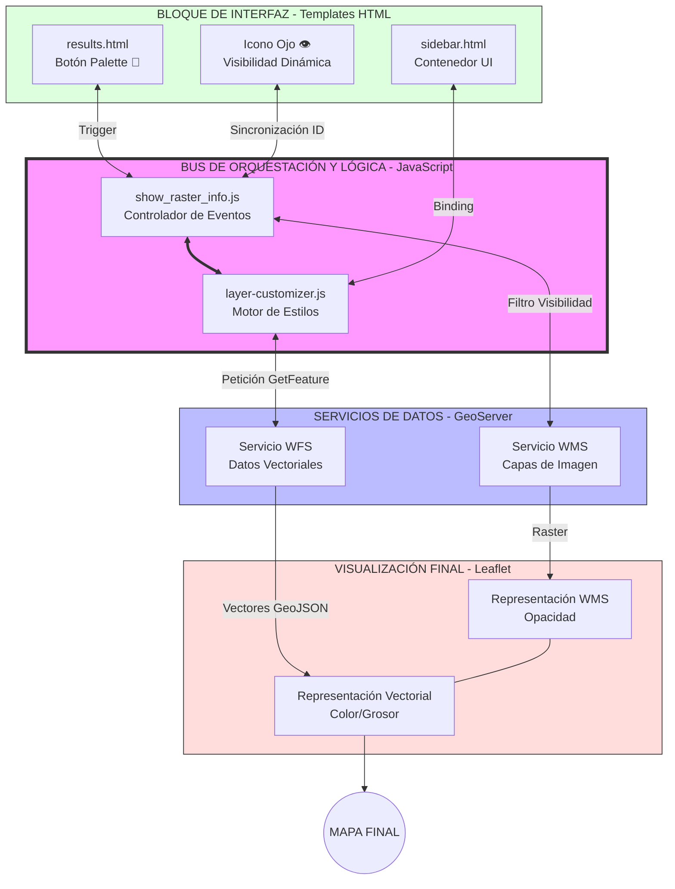

# Registro de Cambios: Sistema de Personalización de Capas

Este documento detalla la implementación técnica del panel de personalización de estilos para las capas del Geoportal, la integración entre los scripts del frontend y la comunicación con GeoServer.

## 1. Resumen de Cambios Finales

Se ha implementado satisfactoriamente la personalización visual de capas y la gestión de visibilidad híbrida (WMS/WFS).

### Archivos Modificados/Creados:
- **`layer-customizer.js` (Nuevo):** Núcleo lógico. Gestiona estilos, descarga WFS (GeoJSON) y controla la visibilidad de los overlays personalizados.
- **`show_raster_info.js` (Modificado):** Orquestador. Intercepta clics en el "ojo" (visibilidad) para alternar entre la capa WMS original o el overlay personalizado según el estado de la capa.
- **`results.html` (Modificado):** Interfaz. Se unificó el uso de `custom_id` en todos los elementos y se añadieron comillas a los atributos HTML para evitar errores de truncado en nombres con espacios.
- **`custom-sidebar.css` (Modificado):** Diseño UI. Panel de control con sliders de opacidad/grosor y selectores de color.

---

## 2. Diagrama de Arquitectura (Modelo de Hardware/Bus)

El sistema funciona como una unidad de procesamiento donde la lógica JS actúa como un bus central:

---

## 3. Resolución de Problemas Críticos (Sincronización)

Durante la implementación final se resolvieron dos fallos que impedían el correcto funcionamiento de la visibilidad:

1.  **Alineación de Identificadores:** Se cambió el uso de `name` por `custom_id` en el HTML para coincidir con la lógica JS.
2.  **Sintaxis HTML (Quotes Fix):** Se añadieron comillas a los atributos `id="..."`. Sin ellas, nombres de capas con espacios (ej: "Capa Base") causaban que el navegador solo leyera la primera palabra ("Capa"), rompiendo la conexión entre el botón y la capa en el mapa.
3.  **Lógica Ocultar/Mostrar:** El botón de visibilidad ahora detecta si hay un overlay de personalización activo. Si existe, lo oculta a él; si no, oculta la capa WMS estándar.

---

## 4. Ejemplo de Flujo de Datos

**Capa:** "Zonas Urbanas" (ID: `urb_01`)
1.  **Carga:** Se pide WMS a GeoServer para visualización rápida.
2.  **Edición:** El usuario elige Color Rojo y Grosor 4.
3.  **Conversión:** `layer-customizer` pide el GeoJSON (`WFS`) de `urb_01`.
4.  **Sustitución:** El mapa oculta el WMS verde del servidor y dibuja el polígono rojo vectorial.
5.  **Control:** Al hacer clic en el 👁️, `show_raster_info` pregunta al Bus: ¿`urb_01` está personalizada? Sí -> Ocultar overlay vectorial.

---
*Documento finalizado según el estado actual del repositorio.*
